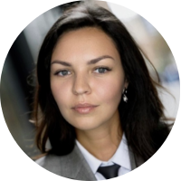

# Профессиональный рост: от медиакоммуникаций к тестированию ПО

Привет!

Меня зовут Ольга, и я пиарщица, которая начала карьеру в сфере тестирования. С февраля 2024 года я прохожу курс "QA Engineer" в Нетологии. На данный момент я уже овладела такими навыками тестирования ПО:

- [x] Понимаю жизненный цикл разработки программного обеспечения
- [x] Подбираю более подходящие техники тест-дизайна (классы эквивалентности, граничные значения)
- [x] Составляю тестовую документацию (чек-листы, тест-кейсы, баг-репорты в Jira)
- [x] Провожу тестирование производительности в JMeter
- [x] Тестирую API (REST API, JSON, Postman)
- [x] Провожу функциональное и UI-тестирование в DevTools
- [x] Работаю с системой контроля версий Git, платформой GitHub

У меня два высших образования: магистр факультета медиакоммуникаций **НИУ ВШЭ**, бакалавр филологического факультета **РУДН**. Также проходила курсы повышения квалификации по связям с общественностью в **МГИМО** и курсы дополнительного образования по направлению “Графический дизайн и коммуникации” в Нетологии.   

10-летний опыт работы в сфере медиакоммуникаций дал мне ценные навыки в области планирования, организации и управления проектами.

Я уверена, что мой профессионализм, стремление к развитию, коммуникабельность и умение эффективно работать в условиях повышенной активности помогут мне успешно влиться в новую сферу.

Для связи:\
TG: @olikataeva\
olgakataeva@list.ru
